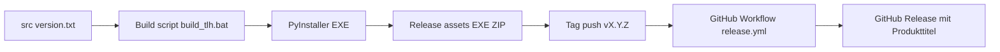

# Dokumentation Releases

## Build- und Release-Übersicht

## Versionierung

- Dateiführend: `src/version.txt`
- Schema: `MAJOR.MINOR.PATCH`
- `scripts/build_tlh.bat` erhöht standardmäßig `PATCH`.

## Release-Checkliste

1. Changelog aktualisieren (`docs/CHANGELOG.md`).
2. Smoke-Test lokal:
   - GUI startet
   - Dokumenterstellung funktioniert
   - Outlook-Entwurf wird erzeugt
3. Build ausführen (`scripts/build_tlh.bat`).
4. ZIP/EXE kurz validieren.
5. Tag/Release in GitHub erstellen.

## Aktueller Release-Stand

- Zuletzt gebaut und dokumentiert: `1.0.0`
- Wichtige Inhalte dieses Releases: Python-Abhängigkeiten auf `src/requirements.txt` standardisiert, neue `src`-Entrypoints (`src/build.ps1`, `src/setup.ps1`) sowie Root-Kompatibilitäts-Entrypoints (`build.ps1`, `setup.ps1`).

## Artefakte

- `dist/Themenlisten-Helfer_<version>.exe`
- `release/Themenlisten-Helfer_<version>.exe`
- `release/Themenlisten-Helfer_v<version>.zip`

## GitHub-Release-Hinweis

Release-Titel auf GitHub folgen dem Schema:

- `Themenlisten-Helfer v...`

Beispiel: `Themenlisten-Helfer v1.0.0`.

Falls versehentlich ein Titel wie `Release v...` entsteht, korrigiert die Guardrail im Release-Workflow den Titel automatisch.

Release Notes sollten enthalten:

- Funktionsänderungen
- Breaking Changes
- Migrationshinweise (falls Pfade/Dateiformate geändert wurden)
- Validierungshinweis, welches Release-Artefakt lokal geprüft wurde (z. B. `release/Themenlisten-Helfer_1.0.0.exe`)

## Release-Workflow testen (Tag-basiert)

1. `src/version.txt` auf die gewünschte Testversion setzen (z. B. `2.4.5`).
2. Tag erstellen und pushen:
   - `git tag v2.4.5`
   - `git push origin v2.4.5`
3. Ergebnis prüfen:
   - GitHub Actions: Release-Workflow erfolgreich
   - GitHub Releases: neues Release inkl. EXE/ZIP-Assets
4. Optional Test-Tag entfernen:
   - `git tag -d v2.4.5`
   - `git push origin :refs/tags/v2.4.5`

## Praktischer Hinweis für das aktuelle Release

Wenn `src/version.txt` bereits auf der gewünschten Version (z. B. `1.0.0`) steht, muss für die GitHub-Veröffentlichung derselbe Commit mit dem passenden Tag (z. B. `v1.0.0`) versehen und gepusht werden. Andernfalls schlägt der Release-Workflow absichtlich fehl.
