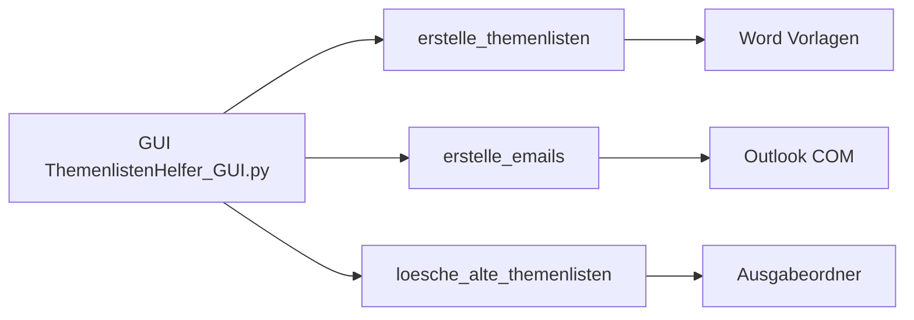
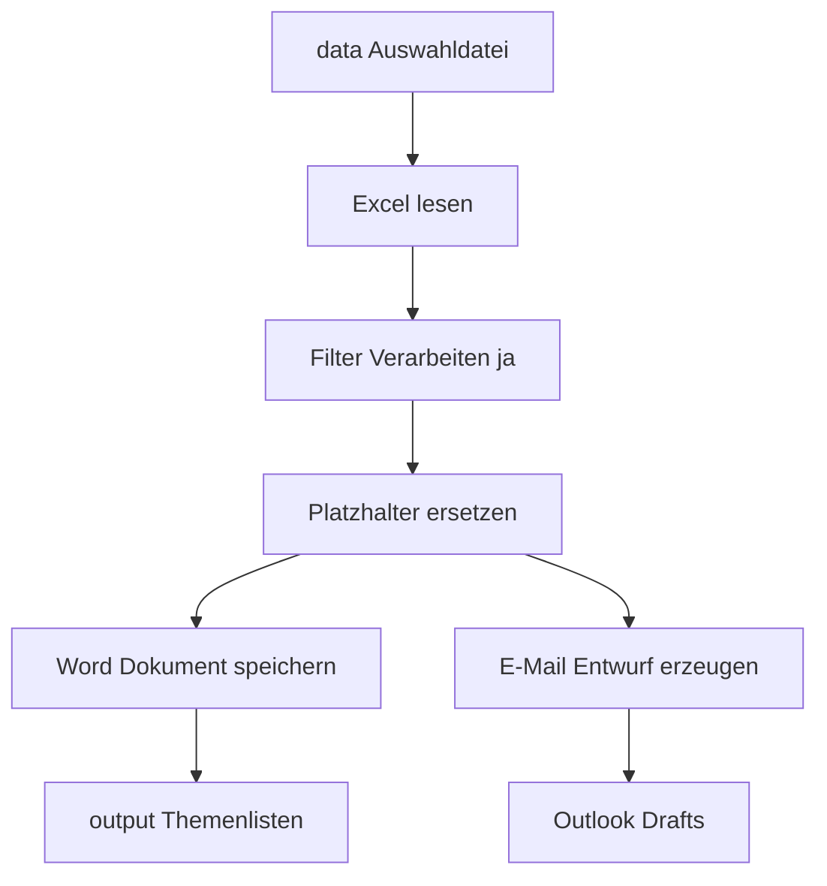

# Entwicklerdokumentation

## Systemüberblick

## Architektur (aktuell)

Monolithische Desktop-Anwendung in `src/ThemenlistenHelfer_GUI.py` mit drei Kernprozessen:

1. `erstelle_themenlisten(...)`
2. `erstelle_emails(...)`
3. `loesche_alte_themenlisten(...)`

Die GUI startet den Ablauf asynchron über einen Thread.

## Pfadstrategie

Die App nutzt bevorzugt die neue Struktur mit Legacy-Fallback:

- Vorlagen: `data/Themenlisten-Vorlagen/` → `templates/Themenlisten-Vorlagen/` → `Themenlisten-Vorlagen/`
- Ausgabe: `Themenlisten/` (ab 2.5.3 fest; vorher `output/Themenlisten/` mit Legacy-Fallback)
- Daten: `data/Auswahl Teilnehmende zu Lernbereichen.xlsx` → Root-Datei
- Version: `src/version.txt` → `config/version.txt` → `version.txt`
- Assets: `assets/icons|images` → Root-Dateien

Für PyInstaller-Onefile gilt zusätzlich:

- Ressourcen werden zuerst relativ zum Bundle (`sys._MEIPASS`) und anschließend relativ zum Anwendungsverzeichnis gesucht.
- Schreiboperationen (z. B. erzeugte Themenlisten) zielen weiterhin auf das EXE-/Projektverzeichnis, nicht auf `_MEIPASS`.

Damit bleiben alte Deployments lauffähig.

## Daten- und Verarbeitungsfluss

## Build & Packaging

- `scripts/build_tlh.bat` erhöht Patch-Version, nutzt explizit das konfigurierte 64-Bit-Python und erstellt die EXE via PyInstaller.
- `src/ThemenlistenHelfer_GUI.spec` enthält notwendige Datenordner.
- ZIP-Archiv wird mit EXE + relevanten Assets/Daten erzeugt.
- Build prüft Abhängigkeiten aus `src/requirements.txt` (Fallback: `requirements.txt`) vor dem Packaging.

## Relevante Korrekturen in `2.5.2`

- robuste Behandlung fehlender/`None`-Pfade vor `exists`-Prüfungen
- differenziertere Ergebnisobjekte für Themenlisten- und E-Mail-Erstellung
- Vorlagensuche für `.docx` und `.dotm`
- korrigierte Pfadbasis im nicht eingefrorenen Betrieb

## Relevante Korrekturen in `2.5.3`

- Ausgabepfad auf einzelnen Ordner `Themenlisten/` vereinfacht; `output/Themenlisten/` entfällt als Schreibziel
- Pylance-Fehler beseitigt: `_MEIPASS`-Attributzugriff abgesichert, `Optional[str]`-Rückgabetyp in `resolve_path`, explizite `None`-Guards vor `os.makedirs` und `os.path.join`
- MIT-Lizenz eingeführt (Copyright Dr. Thomas Gorontzy / GoroTech)
- Anwenderdokumentation um Vorlagen- und E-Mail-Konfigurationshinweise erweitert

## Geplante Modularisierung (`src/`)

Empfohlene Aufteilung in nächsten Schritten:

- `src/io_excel.py`
- `src/docx_renderer.py`
- `src/outlook_mailer.py`
- `src/cleanup.py`
- `src/gui.py`

## Qualitätsrichtlinien

- kleine, testbare Änderungen
- klare Fehlermeldungen für Anwender
- dokumentationspflichtig bei Pfad-/Prozessänderungen

## Bekannte technische Grenzen

- Outlook/Word-Abhängigkeit erfordert Windows + Office.
- Threading + COM: `pythoncom.CoInitialize()` ist gesetzt, dennoch COM-Fehler je nach Systemzustand möglich.
